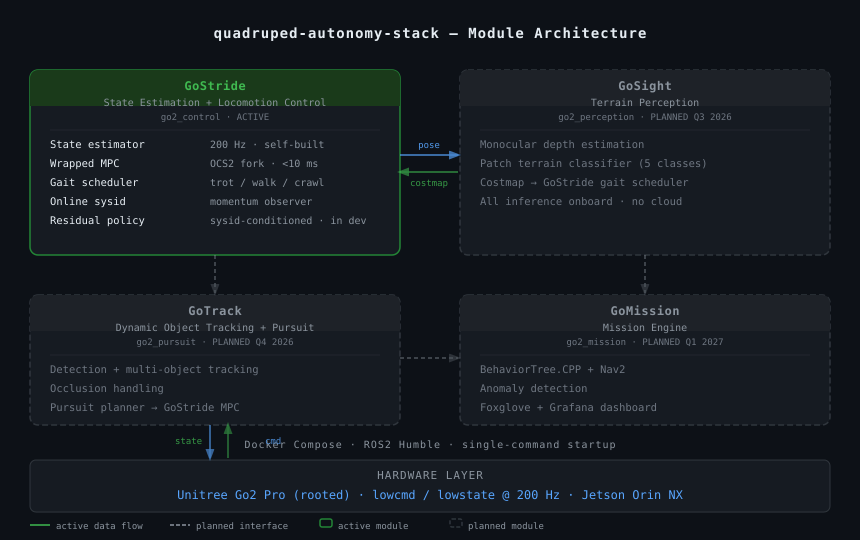

# quadruped-autonomy-stack

**Quadruped autonomy stack for Unitree Go2 Pro **

> Status: **Active development** | Started: May 2026 | Platform: Unitree Go2 Pro (rooted) | Solo engineer, 20 hrs/wk

This repository is the public roadmap and integration index for a full-stack quadruped autonomy project built on a single Go2 Pro. The goal is a field-deployable, containerised system covering state estimation, locomotion control, terrain perception, dynamic tracking, and mission execution.

---

## Why this exists

Building a complete quadruped autonomy stack — from state estimation through mission execution — requires closing the loop across control, perception, and planning on real hardware. This project builds that stack on a single Go2 Pro: hardware-validated, containerised, with documented operating envelopes.

---

## Architecture



---

## Project structure

```
quadruped-autonomy-stack/
├── go2_control/        # GoStride  — EKF + locomotion control  [ACTIVE]
├── go2_perception/     # GoSight   — terrain perception        [PLANNED Q3 2026]
├── go2_pursuit/        # GoTrack   — dynamic object tracking   [PLANNED Q4 2026]
├── go2_mission/        # GoMission — mission engine            [PLANNED Q1 2027]
└── docs/
    ├── architecture/
    ├── benchmarks/
    └── operating-envelopes/
```

---

### Module 1 — GoStride (State Estimation + Locomotion Control)

**Timeline: M1–M6 | Status: In development**

Foundational layer. Everything downstream depends on robust state estimation and reliable locomotion.

**What it covers:**

- **State estimator**: IMU preintegration + leg kinematics odometry + contact estimation. Self-built. 200 Hz output.
- **Wrapped MPC**: OCS2 fork, re-tuned to Go2 Pro hardware parameters. OSQP solver. Target solve time <10 ms onboard.
- **Gait scheduler**: terrain modes (trot / walk / walk-high-clearance / crawl) with linear blending. Initially operator-commanded; auto-triggered by GoSight once available.
- **Online system identification**: generalised-momentum observer + recursive inertia/friction identification during walking. Feeds identified parameters back into MPC online.
- **Learning-based residual** *(in development)*: small residual policy conditioned on sysid estimates, trained with domain randomisation informed by the sysid distribution. Control refinement layer, not a primary controller.

**What it does not claim:** WBC at 500 Hz is SKIP by default pending a hardware SDK latency benchmark. Re-enabled only if the benchmark clears the latency gate and a paying client requires it. Results published regardless of outcome.

**Anchor deliverable:** Hardware video (target M6) — Go2 walking a test course under wrapped+tuned MPC, side-by-side vs stock controller. On-screen metrics: EKF position drift, MPC solve time, gait mode.

---

### Module 2 — GoSight (Terrain Perception)

**Timeline: M7–M9 | Status: Planned**

Perception enabler for GoStride and GoMission. Provides terrain geometry and classification to the control and planning layers.

Planned scope: monocular depth estimation, patch-level terrain classification (5 categories), costmap output subscribed by GoStride's gait scheduler. All processing onboard. No cloud dependency.

*Architecture will be defined and committed once GoStride hardware validation completes.*

---

### Module 3 — GoTrack (Dynamic Object Tracking + Pursuit)

**Timeline: M8–M13 | Status: Planned**

Visual tracking and physical pursuit of a moving target through unstructured environments with obstacle avoidance.

Planned scope: detection + multi-object tracking with occlusion handling, pursuit planner feeding velocity commands to GoStride MPC.

*Architecture to be defined in M7–M8 once GoSight integration is underway.*

---

### Module 4 — GoMission (Mission Engine)

**Timeline: M10–M18 | Status: Planned**

Mission-level orchestration over GoStride, GoSight, and GoTrack.

Planned scope: behaviour tree engine (BehaviorTree.CPP), Nav2 wrap for waypoint navigation, anomaly detection, operator dashboard (Foxglove Studio + Grafana). Containerised, single-command deployment, OTA updates. No custom SaaS backend.

*Architecture to be defined as upstream modules ship.*

---

## SDK benchmark — Week 1 (Gate 0)

Before any controller code is written, the Go2 Pro `lowcmd` interface is benchmarked:

| Metric | Target |
|---|---|
| Joint torque command round-trip latency | median <1 ms, p99 <3 ms |
| Encoder timestamp jitter | σ <0.5 ms over 60 s |
| Packet loss under sustained 200 Hz publish | <0.1% |
| `/lf/lowstate` field availability | `foot_force_est` + `tau_est` populated on all four legs |

Results published as a blog post regardless of outcome. The architecture decision — full WBC, MPC+PD, or `sport_client` — is recorded in `docs/architecture/controller_decision.md` with the benchmark data, before any controller code is written.

---

## Technology stack

| Layer | Choice |
|---|---|
| Middleware | ROS2 Humble |
| Control | C++17, zero-allocation hot paths |
| ML pipeline | PyTorch training → TorchScript / ONNX inference; no Python in runtime hot path |
| MPC solver | OSQP |
| Containers | Docker Compose, single-command startup |
| Operator dashboard | Foxglove Studio + Grafana |

---


## Engineering log

| Date | Update |
|---|---|
| 2026-05 | Repository initialised. SDK benchmark in progress. |

